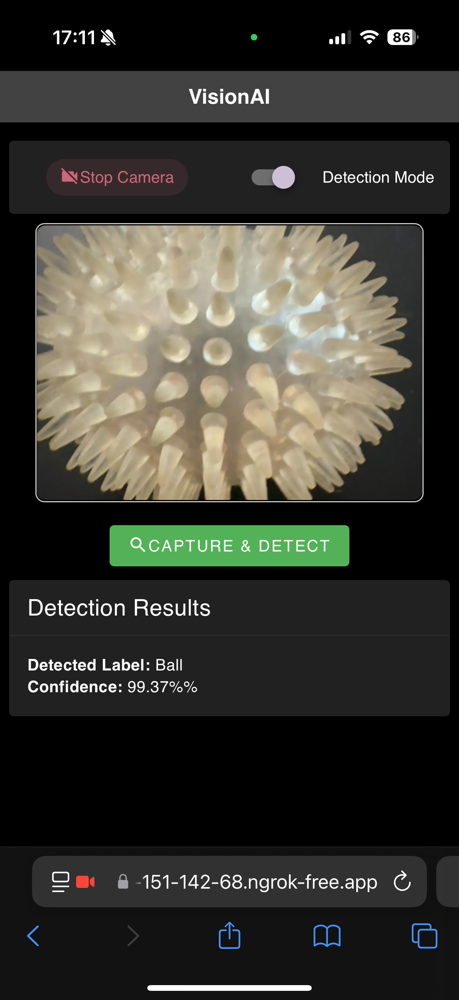

# VisionAI Client App - Vue 3 + TypeScript + Vite Frontend

## 📌 Overview
The **VisionAI App Frontend** is a **Vue 3** application that provides a user-friendly interface for capturing, training, and detecting objects. It interacts with the **backend AI system**, which uses **TensorFlow.js** and **Pinecone** for machine learning and similarity search.

This application enables:
- **Camera Integration**: Start/stop a live video feed to capture images.
- **Training Mode**: Label and train images by sending them to the backend.
- **Detection Mode**: Capture an image, extract features, and identify objects using the backend model.
- **Logging & Debugging**: Uses `LoggerService` to track app events and errors.

---

## 🛠 Setup & Installation

### 1️⃣ Clone the Repository
```bash
git clone https://github.com/your-repo/vision-app-client.git
cd vision-app-client
```

### 2️⃣ Install Dependencies (**Using `pnpm`**)
This project uses **`pnpm`** as the package manager instead of `npm`. If you don’t have `pnpm` installed, run:

```bash
npm install -g pnpm
```

Then install dependencies:

```bash
pnpm install
```

---

### 3️⃣ Configure Environment Variables
Create a `.env` file in the root directory and configure the **backend API URL**:

```
VITE_API_HOST=http://localhost:3000
VITE_VERBOSE=true
```

---

## 🚀 Running the Application
To start the **Vue 3 frontend**, run:

```bash
pnpm run dev
```

This will start a **Vite development server**.  
By default, the application runs on **[http://localhost:5173](http://localhost:5173)**.



---

### 🔥 Benefits of Enhanced Logging
- **Easier Debugging**: Trace **exactly where** failures occur.
- **More Context in Logs**: `DEBUG` logs help inspect values.
- **Error Warnings**: Identifies non-critical issues (`WARN`).
- **Improved Error Handling**: Logs exact API request failures.

Now, **if the app misbehaves, you'll know why!** 🚀

---

## 📬 Conclusion
With this guide, you should be able to:
- Start the **Vue 3 frontend** with **Vite**.
- Capture images and interact with the **backend AI system**.
- Train and detect objects efficiently.
- Debug and log application events.

🚀 **Happy Coding!** 🎉


---

## 🔥 Production Mode with PM2

For production, the client app is served using Vite's preview server and managed by PM2.
This setup uses a small Node wrapper (`start-client.cjs`) and an ecosystem configuration (`ecosystem.config.cjs`)
to ensure the ESM‑based Vite CLI is executed properly.

### 1️⃣ Build the Application

First, compile your client assets:

```bash
pnpm run build
```

### 2️⃣ Production PM2 Setup

Your repository includes the following two files:

#### `start-client.cjs`

A Node wrapper that resolves Vite’s CLI and spawns the preview server on a specified port.
(Ensure this file is at the project root.)

Example content for `start-client.cjs`:

```js
/* eslint-disable @typescript-eslint/no-require-imports */
#!/usr/bin/env node
const { spawn } = require('child_process');
const path = require('path');

// Resolve the Vite CLI JS file explicitly.
const viteCli = path.join(__dirname, 'node_modules', 'vite', 'bin', 'vite.js');
console.log('Using Vite CLI at:', viteCli);

// Spawn Node with an extra flag for specifier resolution.
const child = spawn(
  'node',
  ['--experimental-specifier-resolution=node', viteCli, 'preview', '--port', '5174'],
  { stdio: 'inherit' }
);

child.on('close', (code) => {
  process.exit(code);
});
```

#### `ecosystem.config.cjs`

The PM2 ecosystem configuration that tells PM2 to run `start-client.cjs` with Node in production mode.

Example content for `ecosystem.config.cjs`:

```js
module.exports = {
  apps: [
    {
      name: 'vision-ai-client-app',
      script: './start-client.cjs',
      interpreter: 'node',
      env: {
        NODE_ENV: 'production'
      },
      instances: 1,
      exec_mode: 'fork',
      watch: false,
      max_memory_restart: '300M'
    }
  ]
};
```

### 3️⃣ PM2 NPM Scripts

Your `package.json` includes PM2 scripts for managing the production process.
For example, update your `package.json` scripts section to include:

```json
{
  "scripts": {
    "dev": "vite",
    "build": "vue-tsc -b && vite build",
    "preview": "vite preview",
    "lint": "eslint .",
    "lint:fix": "eslint . --fix",
    "start:pm2": "pm2 start ecosystem.config.cjs",
    "logs:pm2": "pm2 logs vision-ai-client-app",
    "prod": "pnpm start:pm2",
    "prod:logs": "pnpm start:pm2 && pnpm logs:pm2",
    "prod:stop": "pm2 stop vision-ai-client-app",
    "prod:restart": "pm2 restart vision-ai-client-app"
  }
}
```

### 4️⃣ Start in Production Mode

After building the app, start production mode with:

```bash
pnpm prod
```

This command will start your client app using PM2, launching the Vite preview server on port 5174.

### 4️⃣ Start in Production Mode with Logs

After building the app, start production mode with:

```bash
pnpm prod:logs
```

This command will start your client app using PM2, launch the Vite preview server on port 5174, and tail the logs.


---

## 📬 Conclusion

With this guide, you should be able to:

- Start the Vue 3 frontend with Vite in development mode.
- Build the client for production.
- Run and manage the production client app using PM2 with a dedicated Node wrapper and ecosystem configuration.
- Debug and view logs via PM2.

🚀 **Happy Coding!** 🎉
