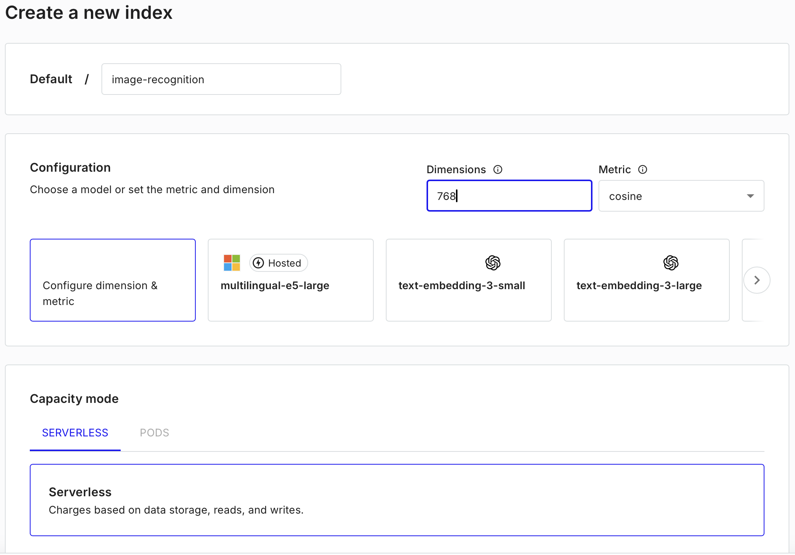
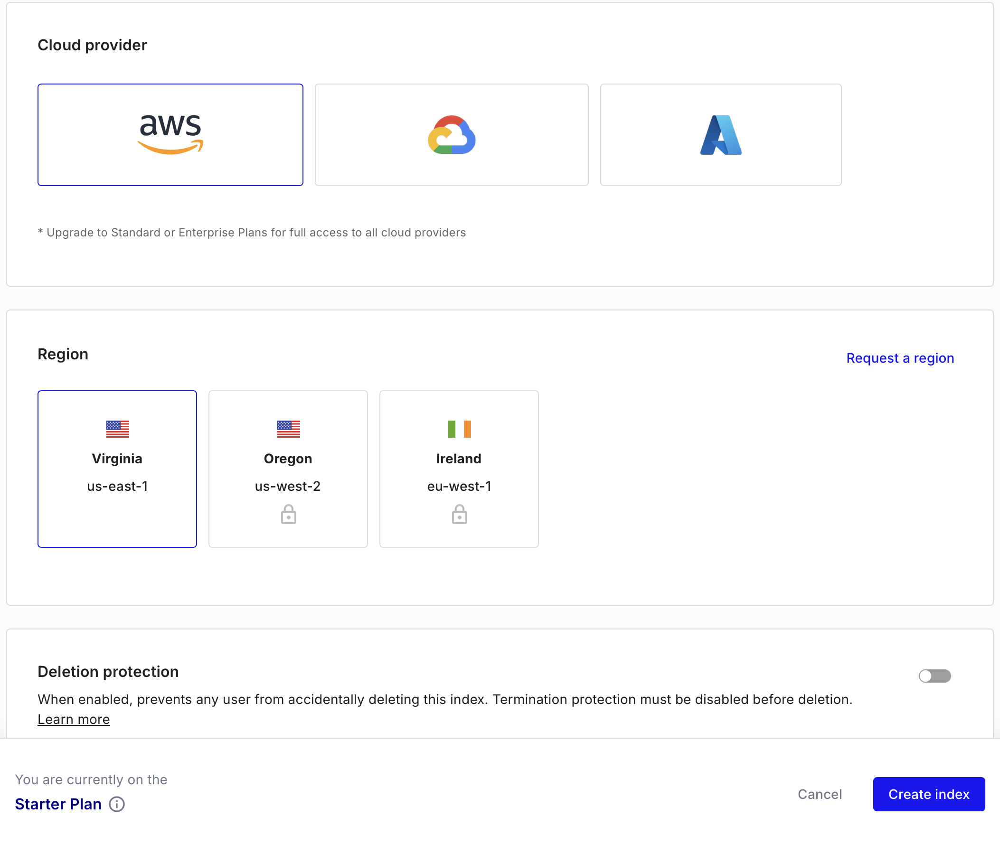

# VisionAI Server App - Image Recognition with Pinecone & TensorFlow.js

## 📌 Overview
The **VisionAI App Backend** is a machine learning-powered image recognition system that uses **TensorFlow.js** for feature extraction and **Pinecone** as a vector database for similarity search. The application allows users to train the model with new images and later detect objects by querying against the trained dataset.

### 🚀 Features
- **Train Mode**: Capture an image, extract features, and store embeddings in Pinecone.
- **Detect Mode**: Capture an image, extract features, and search Pinecone for the most similar object.
- **MobileNet Model**: Uses either:
    - ✅ A pre-trained **MobileNet v2** model loaded dynamically from TensorFlow.js.
    - ✅ A **custom-trained MobileNet v2 model** stored locally.
- **Pinecone Integration**: Stores and retrieves high-dimensional embeddings for efficient similarity search.
- **Node.js & TensorFlow.js**: Eliminates the need for Python dependencies by using TensorFlow.js in a Node.js environment.

---
---

## 📂 Project Structure

```
vision-app/
├── server/                         # Backend (Node.js, TensorFlow.js, Pinecone)
│   ├── services/                   # Core backend services
│   │   ├── logger/                 # Logging service
│   │   │   ├── LoggerService.ts    # Main logging utility
│   │   │   ├── types/              # Logger type definitions
│   │   │   │   ├── DebugLevel.ts   # Debugging levels
│   │   │   │   ├── ILog.ts         # Logging interface
│   │   │   │   ├── index.ts        # Type exports
│   │   │   │   ├── ITrackable.ts   # Trackable entity interface
│   │   │   │   ├── log.ts          # Log structure definition
│   │   │   │   ├── LogType.ts      # Enum for log types
│   ├── src/                        # Main backend logic
│   │   ├── embeddings.ts           # Embedding management
│   │   ├── handlers.ts             # Request handlers
│   │   ├── index.ts                # Main entry point (ES module)
│   │   ├── pinecone.ts             # Pinecone database interactions
│   │   ├── routes.ts               # API routes
│   │   ├── utils.ts                # Helper functions
│   ├── .env                        # Environment variables
│   ├── .env.example                # Environment variables
│   ├── README.md                   # Backend documentation
│   ├── dist                        # Dependencies & scripts
│   ├── package.json                # Dependencies & scripts
│   ├── pnpm-lock.json              # Dependencies & scripts
│   ├── requirements.txt            # Dependencies & scripts
│   ├── tsconfig.build.json         # Dependencies & scripts
│   ├── tsconfig.json               # Dependencies & scripts
│   ├── vercel.json                 # Dependencies & scripts
│   └──
└── 
```

---

## 🛠 Setup & Installation

### 1️⃣ Clone the Repository
```bash
git clone https://github.com/your-repo/vision-app.git
cd vision-app
```

### 2️⃣ Install Dependencies (**Using `pnpm`**)
This project uses **`pnpm`** as the package manager instead of `npm`. If you don’t have `pnpm` installed, run:

```bash
npm install -g pnpm
```

Then install dependencies with:

```bash
pnpm install
```

---

### 3️⃣ Configure Environment Variables
Create a `.env` file in the **server** directory and add your Pinecone API key & index name:
```
PINECONE_API_KEY=your-pinecone-api-key
PINECONE_INDEX_NAME=image-recognition
PINECONE_DIMENSIONS=768
USE_CUSTOM_MODEL=true   # Set to 'true' to use the custom model in /models/mobilenet/mobilenet_tfjs/
```

#### 📌 Model Selection
- **Set `USE_CUSTOM_MODEL=true`** to use a locally stored MobileNet v2 model at:
  ```
  /server/models/mobilenet/mobilenet_tfjs/
  ```
- **Set `USE_CUSTOM_MODEL=false`** to load MobileNet v2 dynamically from TensorFlow.js.

---

## 📌 **Pinecone Setup**
### **Step 1: Create a Pinecone Index**
1. **Sign up for Pinecone**
  - If you don’t already have an account, sign up at [https://www.pinecone.io/](https://www.pinecone.io/).

2. **Create an Index**
  - Navigate to the **Pinecone Console** → **Indexes** and create a new index.
  - Use the following settings:
    - **Index Name:** `image-recognition`
    - **Dimensions:** `768` (For MobileNet v2)
    - **Metric:** `cosine` (Best for similarity search)
    - **Cloud Provider:** AWS
    - **Region:** 🇺🇸Virginia (us-east-1)
    - 
    - 

3. **Create and/or Get Your API Key**
  - Find your API Key in the **Pinecone Console** under **API Keys**.

---

## 🚀 Running the Application
### Start the Backend Server
```bash
pnpm dev
```

---

## 🔥 API Endpoints
### **Train an Image** (Save to Pinecone)
```http
POST /train
```

### **Detect an Object** (Find Similar in Pinecone)
```http
POST /detect
```

---

## 📥 **Downloading & Preparing Custom MobileNet Model**
If you want to use a **custom-trained MobileNet model**, follow these steps:

### **Step 1: Install python3.11**
NOTE: TensorFlow.js (TFJS) Converter relies on TensorFlow 2.x, which has official support for Python 3.11.
```bash
brew install python@3.11
```

### **Step 2: Create a Python Virtual Environment**
- `cd` into the **server** directory.

- Run the following:
```bash
python3.11 -m venv .vision-ai --prompt vision-ai
source .vision-ai/bin/activate
```

### **Step 3: Install requirements
```bash
pip3.11 install -r requirements.txt
```

### **Step 3: Download the Model**
Download **MobileNet V2** from **Kaggle**:
- [🔗 Kaggle Model - MobileNet V2](https://www.kaggle.com/models/google/mobilenet-v2/tensorFlow2/140-224-classification)
- Select **Variation: 140-224-classification**
- Click **Download**
- Extract the downloaded model
- Rename the directory to `mobilenet`
- Move the `mobilenet` directory into:
  ```
  /server/models/
  ```

### **Step 4: Use sudo to Get Write Access**
```bash
sudo chmod -R 777 ~/path-to-cloned-repo/vision-ai/server/src/models/
```

### **Step 5: Convert the Model for TensorFlow.js**
In terminal, `cd` to `/server/src/models`

Run the following command to convert it to **TensorFlow.js Layers format**:
```bash
tensorflowjs_converter --input_format=tf_saved_model --output_format=tfjs_graph_model ./mobilenet ./mobilenet/mobilenet_tfjs
```

### **Step 6: Set Environment Variable in .env file**
```
USE_CUSTOM_MODEL=true
```

---

## 📖 Documentation
- 📜 **TensorFlow.js MobileNet Docs** → [TensorFlow MobileNet](https://github.com/tensorflow/tfjs-models/tree/master/mobilenet)
- 📜 **Pinecone Docs** → [Pinecone Official Documentation](https://docs.pinecone.io/)
- 📜 **Kaggle Google | mobilenet_v2 Docs** → [Kaggle Google | mobilenet_v2 Docs](https://www.kaggle.com/models/google/mobilenet-v2/tensorFlow2/140-224-classification)
- 📜 **Frontend Docs** → [client/README.md](../client/README.md)

---

## 📬 Conclusion
With this guide, you should be able to:
- ✅ **Set up Pinecone for vector storage.**
- ✅ **Train images & store embeddings.**
- ✅ **Query Pinecone to detect objects.**
- ✅ **Use a pre-trained or custom MobileNet model.**

🚀 **Happy Coding!** 🎉
